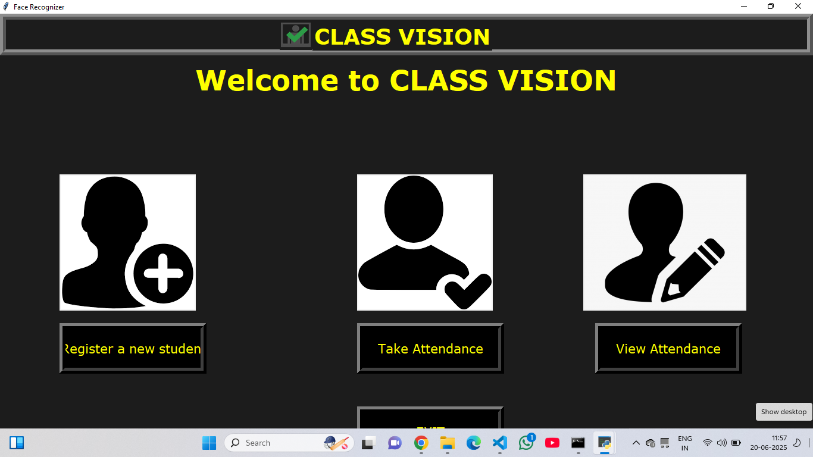

 # 🎓 Face Recognition Based Attendance System

This is a real-time facial recognition attendance system built using Python and OpenCV. The system captures, trains, and recognizes student faces using a webcam and logs attendance into a CSV file.

---

## 🧑‍💻 Developed By
**Ansh Dubey**  
B.Tech – Electronics and Instrumentation Engineering  
Sir Chhotu Ram Institute of Engineering & Technology, Meerut

---

## 🚀 Features

- Real-time face detection via webcam
- Face recognition and automatic attendance marking
- Training new student faces
- GUI interface using Tkinter
- Subject-wise attendance saved in `.csv` files

---

## 🛠 Technologies Used

- Python 3
- OpenCV
- `face_recognition` / Dlib
- NumPy, Pandas
- Tkinter
- `pyttsx3` (for voice alerts)

---

## 📸 Screenshots

### 🖥 GUI Interface  


### 📸 Face Capture  


### 📊 Attendance Log  


---

## 📁 Project Structure

```plaintext
├── attendance.py
├── trainImage.py
├── automaticAttendance.py
├── studentDetails/
├── TrainingImage/
├── Attendance/
├── gui.png
├── training.png
├── attendance.png
└── README.md
